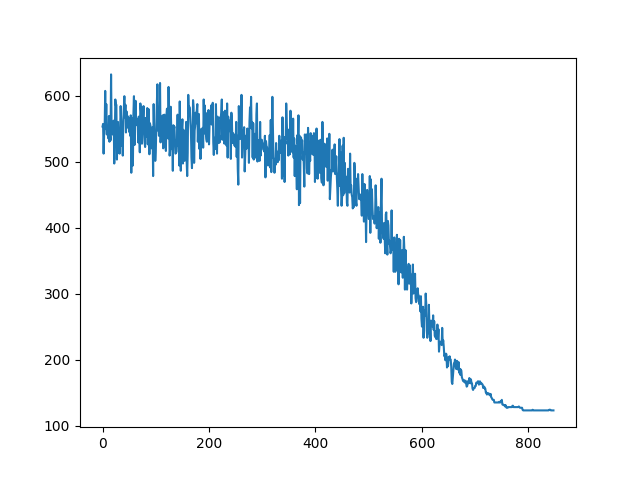

## 回溯法
数据集生成：随机生成一个200^2的列表。

添加剪枝


## 模拟退火
初始温度越高，且马尔科夫链越长，得到全局最优解的可能性越大，耗费更多的计算时间。

```
T0 = 1000  # 初始温度
T_end = 0.5  # 冷却温度
q = 0.98  # 每次退火的比例
L = 1000  # 每个温度的迭代次数
```

调整参数，最终大约稳定在130左右



## 粒子群优化算法

速度更新方面：


