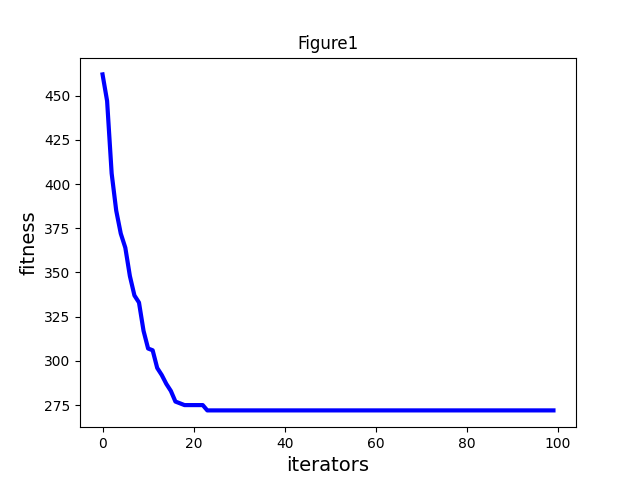

## 回溯法
数据集生成：随机生成一个200^2的列表。

添加剪枝

## 分支限界法

## 模拟退火
初始温度越高，且马尔科夫链越长，得到全局最优解的可能性越大，耗费更多的计算时间。

```
T0 = 1000  # 初始温度
T_end = 0.5  # 冷却温度
q = 0.98  # 每次退火的比例
L = 1000  # 每个温度的迭代次数
```

调整参数，最终大约稳定在130左右


## 粒子群优化算法

速度更新方面：


```python
def iterator(self):
    fitness = []
    for step in range(self.max_iter):  # 迭代次数，不是越多越好
        for i in range(self.pN):  # 更新g_best和p_best
            temp = self.distance_sum(self.X[i])
            if temp < self.p_fit[i]:  # 更新个体最优
                self.p_fit[i] = temp
                self.p_best[i] = self.X[i]
                if self.p_fit[i] < self.g_fit:  # 更新全局最优
                    self.g_best = self.X[i]
                    self.g_fit = self.p_fit[i]

            # 计算交换序列，即 v = r1(p_best-xi) + r2(g_best-xi)
            ss1 = self.get_ss(self.p_best[i], self.X[i], self.r1)
            ss2 = self.get_ss(self.g_best, self.X[i], self.r2)
            ss = ss1 + ss2
            self.X[i] = self.do_ss(self.X[i], ss)

        fitness.append(self.g_fit)
        print(self.X[0], end=" ")
        print("最优答案：\n", self.g_fit)  # 输出最优值
    return fitness

```
此时的收敛值较大，陷入了局部最优


反复调整参数后最优路径总里程仍在250左右，效果较差。


